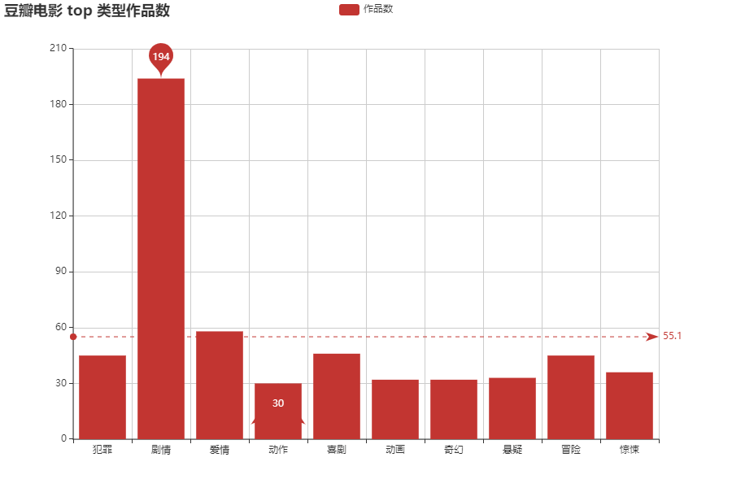
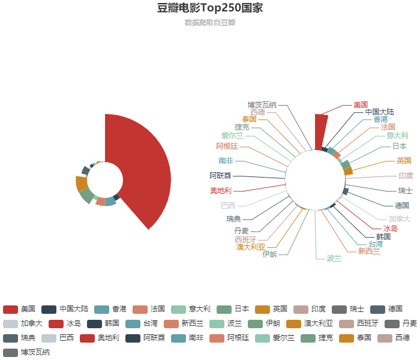
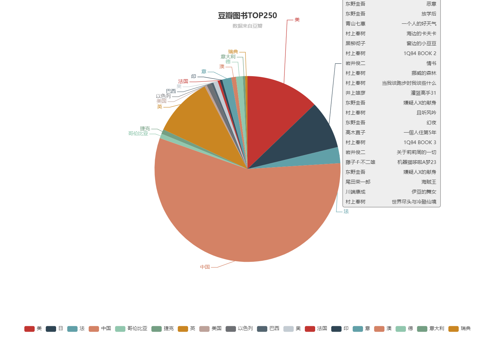

# crawler 
爬取豆瓣TOP250 ，验证登录爬取知乎首页

- 实现对豆瓣电影和图书分别进行 top250 信息实现分页爬取

- 利用缓存功能，自动提取重复信息，提升爬虫速度

- 清洗数据，使数据转换为想要的格式

- 通过抓包工具分析 HTTP Headers，爬取需要登录或者权限验证才能获取的信息

豆瓣电影top250:

豆瓣图书top250:

## 其它

- 数据使用 Node.js 制作爬虫程序  爬取页面数据
- 前端使用 echarts 制作页面  进行数据可视化分析
